Geog4/6300: Lab 5
================

## One and two sample difference tests; ANOVA; Goodness of fit tests

**Value:** 30 points

**Overview:** This lab continues work with the CPS dataset you used in
Lab 4. You’ll be conducting normality tests, two sample t tests, chi
square tests, and ANOVA to test for differences within these data.

\#\#\#Part 1: Testing the normality of the EARNWEEK variable

We’re going to look at the variable for average weekly income: EARNWEEK.
Load the IPMUS CPS dataset in this repository using read\_csv. Filter
these data so you have only valid responses, removing any observations
with a value of 9999.99. Now let’s test the normality of this variable.

**Question 1 (2 points)** *Load the CPS data and filter it to only valid
responses.*

``` r
CPSdata<-read.csv("data/IPUMS_CPS_FoodSec.csv")%>%
  filter(EARNWEEK != "9999.99")
```

**Question 2 (5 points)** *To assess the normality of the EARNWEEK
variable, create a random sample of 5,000 records using the sample\_n
function (look it up in help for more information). Then do the
following: 1) Perform a Shapiro-Wilk normality test on this variable. 2)
Create a Q-Q plot with a line showing the normal distribution. 3) Create
a histogram using ggplot or the base R function.*

``` r
sample5k<-sample_n(CPSdata, 5000)

shapiro.test(sample5k$EARNWEEK)
```

    ## 
    ##  Shapiro-Wilk normality test
    ## 
    ## data:  sample5k$EARNWEEK
    ## W = 0.8654, p-value < 2.2e-16

``` r
qqnorm(sample5k$EARNWEEK); qqline(sample5k$EARNWEEK)
```

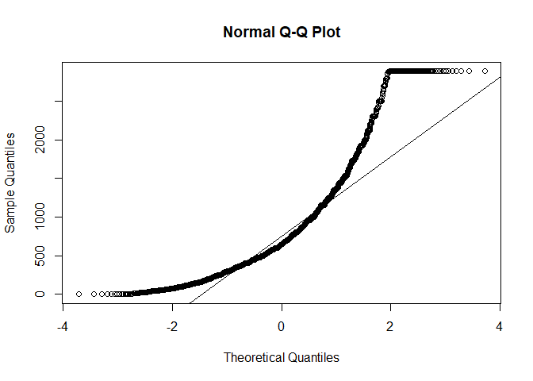<!-- -->

``` r
#qqplot(sample5k$EARNWEEK)
ggqqplot(sample5k$EARNWEEK)
```

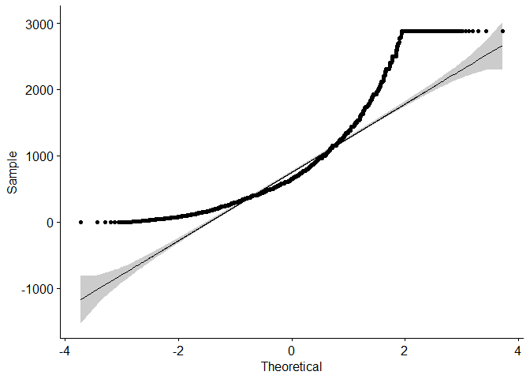<!-- -->

``` r
hist(sample5k$EARNWEEK) 
```

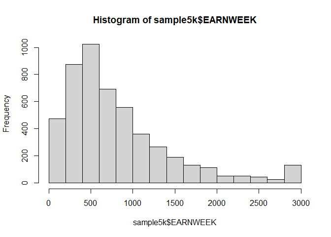<!-- -->

``` r
ggplot(sample5k,aes(x=EARNWEEK)) + geom_histogram()
```

    ## `stat_bin()` using `bins = 30`. Pick better value with `binwidth`.

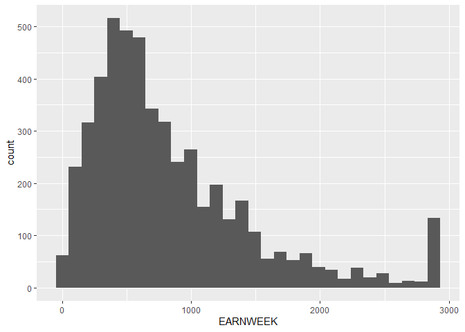<!-- -->

**Question 3 (3 points)** *Based on the results you saw in question 1,
is this variable normally distributed? How do each of those three tests
inform your decision?*

The variable does not appear to be normally distributed. This is
evidenced by the pronounced curve and the subsequent plateau in the
QQ-plot. The p-value provided by the Shapiro-Wilk test is extremely
small (less than .05) which also signifies that the data set in question
varies significantly when compared to a theoretical normal distribution.
The low p-value also indicates that the null hypothesis, “There is no
significant difference between our data set and a theoretical normal
distribution of the same data”, should be rejected. Additionally, the
histogram created shows a clear positive skew in the data.

\#\#\#Part 2: Testing the differences between states\#\#\#

Based on the results of the previous questions, test whether the incomes
of survey respondents in Atlanta (METAREA code 521) and Chicago (1605)
metropolitan areas were equal or different.

**Question 4 (3 points)** *Based on the normality of the data, what is
the appropriate test for determining if actual household incomes between
these cities are significantly different (p=0.05)? Explain why this test
is appropriate and give a null and alternative hypothesis for this test*

Given that the data is not normal, I believe the most appropriate test
to be the Wilcoxon rank-sum test given that we are only interested in
one particular variable from one particular data set and how it compares
to a theoretically normal distribution of the same data. Null
hypothesis: there is a significant statistical difference between the
average weekly earnings in Atlanta and the average weekly earnings in
Chicago. Alternative hypothesis: there is no statistical difference
between the weekly earnings of people in Chicago and those in Atlanta.

**Question 5 (3 points)** *Create separate data frames for each metro.
Then run the test you identified in question 3. Also identify the mean
and median values for each dataset.*

``` r
atlanta<-CPSdata%>%
  filter(METAREA == "521")
mean_earnings_atl = mean(atlanta$EARNWEEK)
median_earnings_atl = median(atlanta$EARNWEEK)

chicago<-CPSdata%>%
  filter(METAREA == "1605")
mean_earnings_chi = mean(chicago$EARNWEEK)
median_earnings_chi = median(chicago$EARNWEEK)

shapiro.test(atlanta$EARNWEEK)
```

    ## 
    ##  Shapiro-Wilk normality test
    ## 
    ## data:  atlanta$EARNWEEK
    ## W = 0.87201, p-value < 2.2e-16

``` r
shapiro.test(chicago$EARNWEEK)
```

    ## 
    ##  Shapiro-Wilk normality test
    ## 
    ## data:  chicago$EARNWEEK
    ## W = 0.87689, p-value < 2.2e-16

``` r
qqnorm(chicago$EARNWEEK); qqline(chicago$EARNWEEK)
```

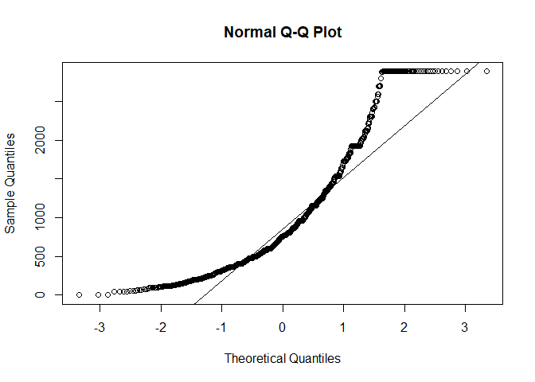<!-- -->

``` r
qqnorm(atlanta$EARNWEEK); qqline(atlanta$EARNWEEK)
```

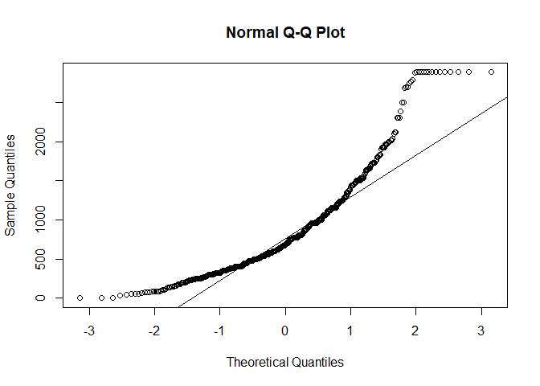<!-- -->

``` r
ggqqplot(atlanta$EARNWEEK, title = "ATL Earnweek")
```

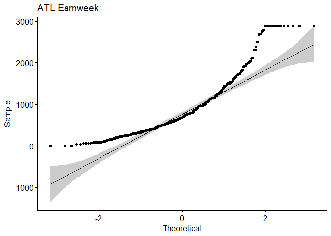<!-- -->

``` r
ggqqplot(chicago$EARNWEEK, title = "CHI Earnweek")
```

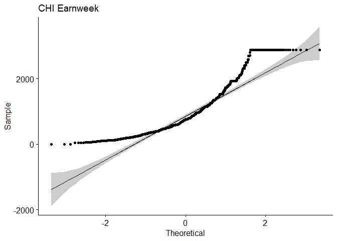<!-- -->

``` r
hist(atlanta$EARNWEEK)
```

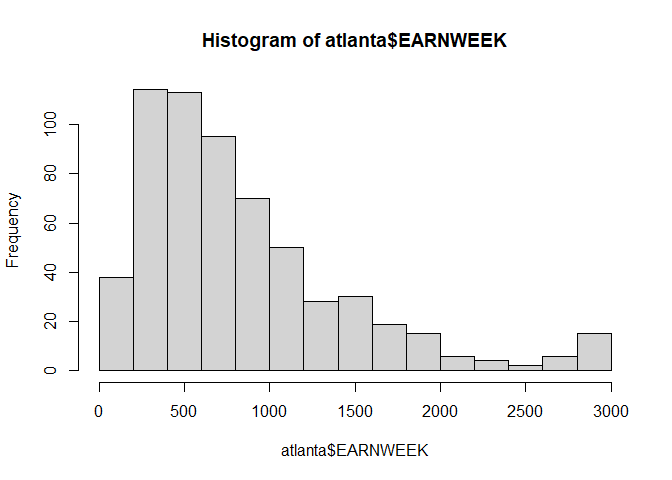<!-- -->

``` r
hist(chicago$EARNWEEK)
```

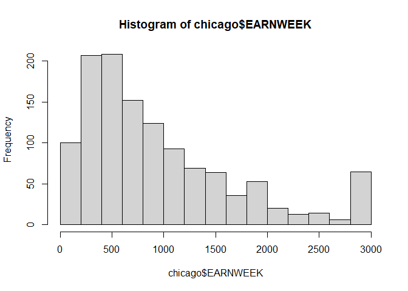<!-- -->

``` r
wilcox.test(atlanta$EARNWEEK, chicago$EARNWEEK)
```

    ## 
    ##  Wilcoxon rank sum test with continuity correction
    ## 
    ## data:  atlanta$EARNWEEK and chicago$EARNWEEK
    ## W = 350825, p-value = 0.0674
    ## alternative hypothesis: true location shift is not equal to 0

**Question 6 (2 points)** *Interpret the results of the analysis you did
in question 4. Do you reject the null hypothesis? Why or why not? What
can we say about household incomes in these two metros?*

While the p-value in this case is quite small, it is still greater than
0.05 which means it is not statistically significant enough to accept
the null hypothesis. Therefore, we reject the null hypothesis and accept
the alternative hypothesis in this particular case. The household data
from the two cities does not differ significantly.

\#\#\#Part 3: Analyzing differences in rates for use of food assistance

While the U.S. Census regularly provides data on use of SNAP/Food stamp
benefits, the CPS provides data on other emergency food sources. Here,
you will look at use of emergency food from a church, food pantry, or
food bank over the last year (FSFDBNK) in New York, New Jersey, and
Pennsylvania.

**Question 7 (2 points)** *Go back to the original CPS dataset and
filter for records with valid responses to FSFDBNK (\<6 on the scale)
that are in the states listed above. Call the head of the table when
done*

``` r
FSFDBNK_usage<-CPSdata %>%
  filter(FSFDBNK < 6, STATE %in% c("New York", "New Jersey", "Pennsylvania"))
kable(head(FSFDBNK_usage))
```

| STATE    | Region           | YEAR |    CPSID | STATEFIP | STATECENSUS | METAREA | FSSTATUS | FSSTATUS\_cat | FSSTATUSA | FSSTATUSC | FSFDSTMP | FSWIC | FSFDBNK | FSSOUPK | FSPOOR | AGE | SEX | RACE | MARST |  BPL | YRIMMIG | CITIZEN | HISPAN | EDUC | EMPSTAT |  IND | EARNWEEK | DIFFANY |
| :------- | :--------------- | ---: | -------: | -------: | ----------: | ------: | -------: | :------------ | --------: | --------: | -------: | ----: | ------: | ------: | -----: | --: | --: | ---: | ----: | ---: | ------: | ------: | -----: | ---: | ------: | ---: | -------: | ------: |
| New York | Northeast Region | 2010 | 2.01e+13 |       36 |          21 |    1280 |        2 | low\_fs       |         3 |        99 |        1 |    99 |       1 |       1 |      1 |  48 |   1 |  100 |     4 | 9900 |       0 |       0 |      0 |   73 |      10 | 7870 |   519.23 |       1 |
| New York | Northeast Region | 2010 | 2.01e+13 |       36 |          21 |    1280 |        2 | low\_fs       |         3 |        99 |        1 |    99 |       1 |       1 |      1 |  23 |   1 |  100 |     6 | 9900 |       0 |       0 |      0 |   81 |      10 | 8680 |   165.00 |       1 |
| New York | Northeast Region | 2010 | 2.01e+13 |       36 |          21 |    9999 |        1 | food\_secure  |         1 |        99 |        1 |     0 |       1 |       1 |      2 |  40 |   2 |  100 |     1 | 9900 |       0 |       0 |      0 |   81 |      10 | 1170 |   769.23 |       1 |
| New York | Northeast Region | 2010 | 2.01e+13 |       36 |          21 |    9999 |        1 | food\_secure  |         1 |        99 |        1 |     0 |       1 |       1 |      2 |  48 |   1 |  100 |     1 | 9900 |       0 |       0 |      0 |   73 |      10 | 4690 |   880.00 |       1 |
| New York | Northeast Region | 2010 | 2.01e+13 |       36 |          21 |    9999 |        1 | food\_secure  |         1 |        99 |        1 |     0 |       1 |       1 |      2 |  21 |   1 |  100 |     6 | 9900 |       0 |       0 |      0 |   81 |      10 | 8680 |   126.00 |       1 |
| New York | Northeast Region | 2010 | 2.01e+13 |       36 |          21 |    6840 |        1 | food\_secure  |         2 |         1 |        2 |     0 |       1 |       1 |      1 |  35 |   1 |  100 |     1 | 9900 |       0 |       0 |      0 |   71 |      10 | 9370 |   204.60 |       1 |

**Question 8 (3 points)** *Create a contingency table of responses to
the FSFDBNK variable (the columns of the table) by state using the table
function. Then conduct a chi square test on this table.*

``` r
FDBNK_contingency<-FSFDBNK_usage%>%
  group_by(STATE, FSFDBNK)%>%
  summarise(count = n())%>%
  pivot_wider(names_from = FSFDBNK, values_from = count, values_fill=0)%>%
  ungroup()
```

    ## `summarise()` regrouping output by 'STATE' (override with `.groups` argument)

``` r
chisq.test(FDBNK_contingency %>% select(-STATE))
```

    ## Warning in chisq.test(FDBNK_contingency %>% select(-STATE)): Chi-squared
    ## approximation may be incorrect

    ## 
    ##  Pearson's Chi-squared test
    ## 
    ## data:  FDBNK_contingency %>% select(-STATE)
    ## X-squared = 11.431, df = 8, p-value = 0.1785

**Question 9 (4 points)** *Create a small multiples bar graph, faceted
by state, that shows the number of responses in each category for the
table you created in question 11. You will need to use stat=“identity”
in the geom\_bar function. You will also need to use scales=“free” as a
parameter in the faceting function to let the y axis values vary by
state.*

``` r
FDBNK_contingency_long<-FDBNK_contingency%>%
  pivot_longer(cols = `1`:`2`, values_to = "Value", names_to = "Category")

FDBNK_plot<- ggplot(FDBNK_contingency_long, aes(x = Category, y = Value))+
  geom_bar(stat = "identity")+
  facet_wrap(vars(STATE), scales = "free")

FDBNK_plot + theme_linedraw()
```

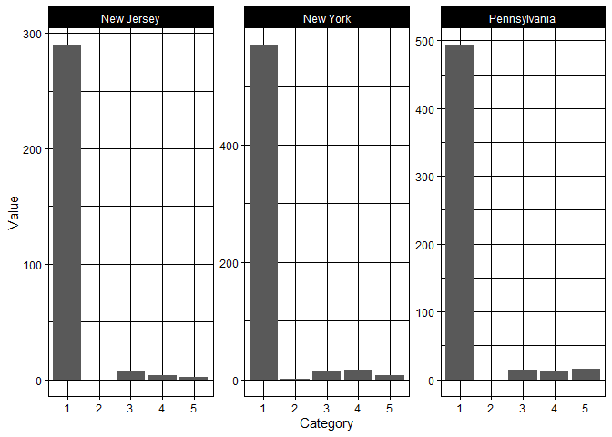<!-- -->

**Question 10 (3 points)** *What were your null and alternative
hypotheses for the chi square test? Based on the results of your test
and the visualization you made for question 12, what conclusions can you
make about food bank usage? *

Null hypothesis: there is no significant statistical difference between
the foodbank usage rates between the cities. Alternative hypothesis:
there is a statistically significant difference between the usage rates
for each city. In this particular case, the p-value is greater than 0.05
so there is not a statistically significant difference between the
foodbank usage between the cities. The null hypothesis is accepted. The
histograms also show the variability between the cities.

\#\#\#Extra credit\! (2 points) Calculate which city in this three state
area is highest for category 1 (no usage of food bank sites). What is
city and what is their rate? To calculate this, you’ll need to count
responses grouped by the METAREA variable within the regional dataset
you created in question 7.

``` r
city_security<-FSFDBNK_usage%>%
  group_by(FSFDBNK, METAREA)%>%
  summarise(count=n())%>%
  pivot_wider(names_from = FSFDBNK, values_from = count, values_fill=0)%>%
  ungroup()%>%
  mutate(total=rowSums(.[2:6]))%>%
  mutate(rate=`1`/total)
```

    ## `summarise()` regrouping output by 'FSFDBNK' (override with `.groups` argument)
